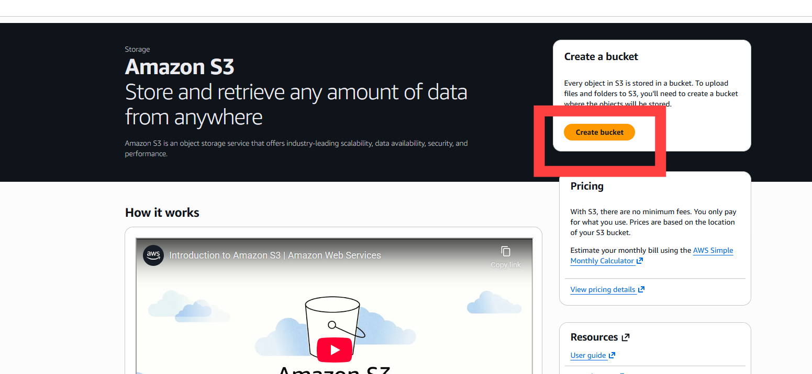
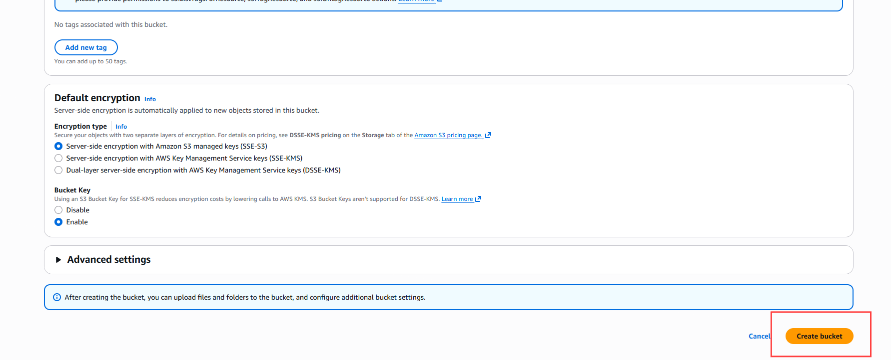
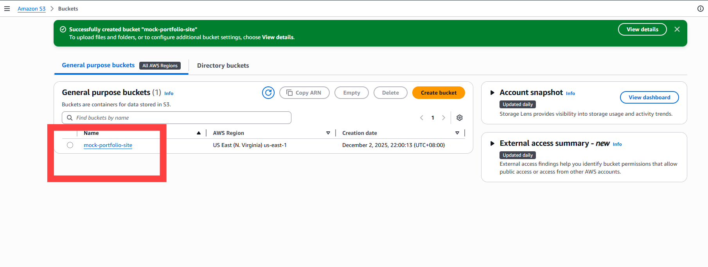
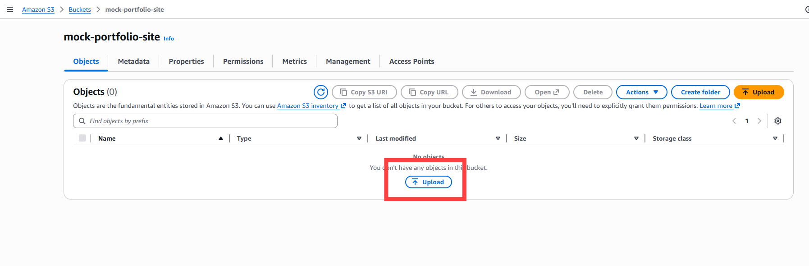
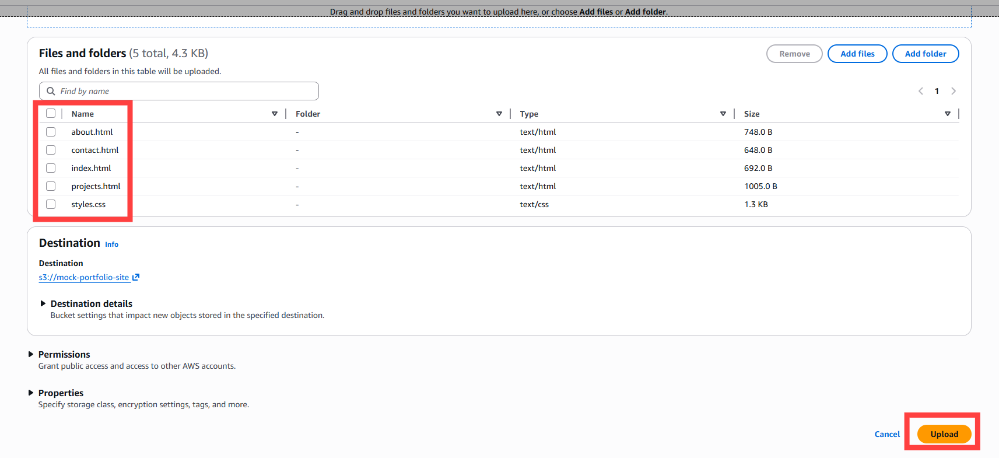
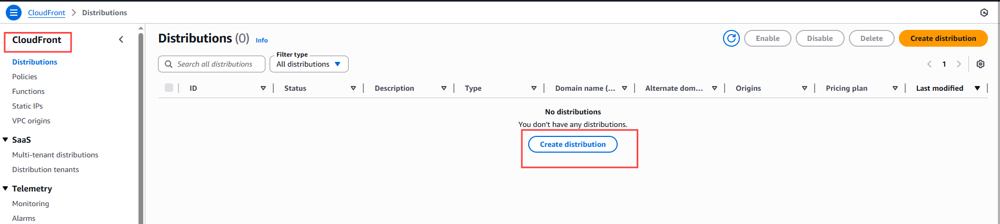
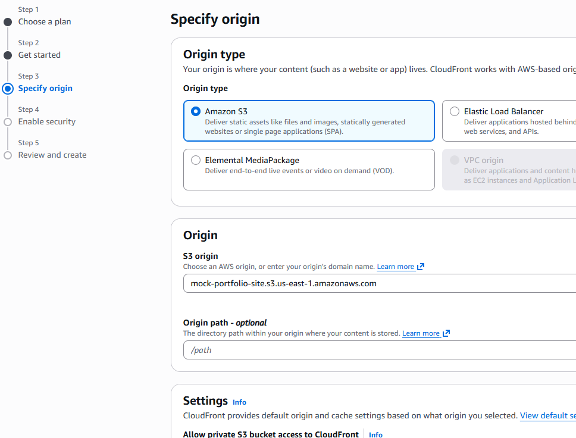
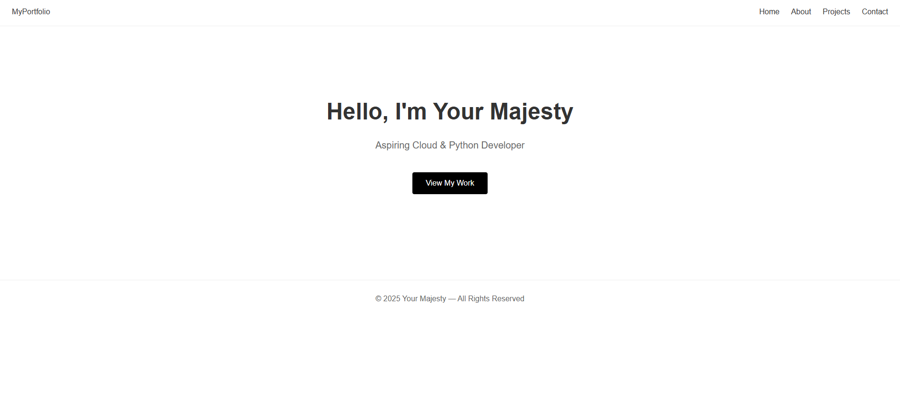
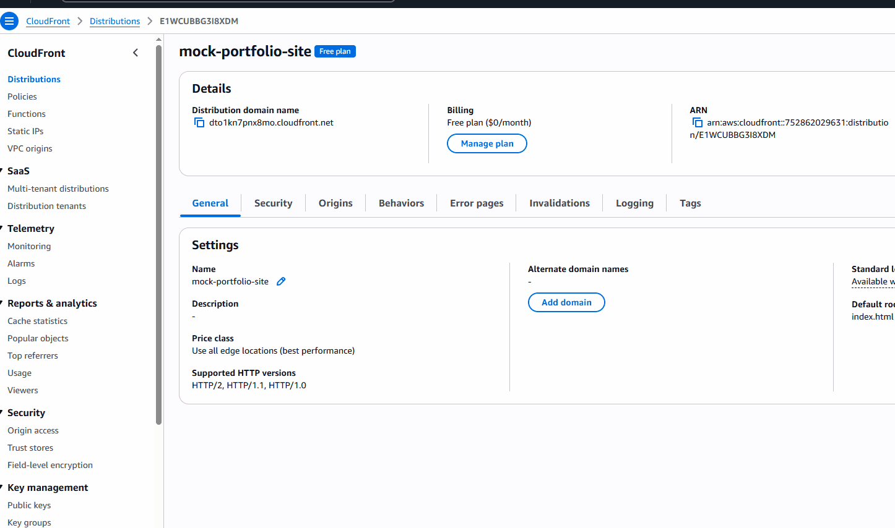

# 🌐 AWS Static Website Hosting (S3 + CloudFront)
A clean, minimal portfolio website hosted on **Amazon S3** and delivered globally through **Amazon CloudFront** with HTTPS, caching, and secure OAC (Origin Access Control).

This project demonstrates AWS fundamentals such as S3 hosting, IAM security, CloudFront CDN, object storage, website delivery optimization, and static asset management.

---

## 🏗️ Architecture Overview

### **Services Used**
- **Amazon S3** – object storage for static website files  
- **Amazon CloudFront** – global CDN + HTTPS + caching  
- **OAC (Origin Access Control)** – secure access between CloudFront and S3  
- **IAM** – bucket access policies  
- **AWS Console** – deployment & configuration

---

## 📘 Architecture Diagram

User → CloudFront (HTTPS) → S3 Bucket (Private)

---

## 📂 Folder Structure

aws-portfolio-site/
│
├── index.html
├── about.html
├── projects.html
├── contact.html
├── styles.css
└── README.md

---

## 🧰 Features

- Fast global content delivery with CloudFront CDN  
- HTTPS enabled (auto certificate from CloudFront)  
- S3 bucket remains **private** (secured via OAC)  
- Zero servers (fully serverless)  
- Minimal, modern UI  
- 100% Free Tier friendly  
- Easily extendable (blog, dark mode, more pages)

---

## 🛠️ Deployment Steps (Summary)

### **1. Create S3 bucket**
- Unique bucket name  
- Block all public access (ON)  
- Upload HTML/CSS files

### **2. Create CloudFront distribution**
- Origin: S3 bucket  
- Enable **Origin Access Control (OAC)**  
- Update bucket policy automatically  
- Set **Default root object:** `index.html`  
- Redirect HTTP → HTTPS  

### **3. Test website**

`https://<cloudfront-domain>/`

---

## 🔐 Security Highlights

- S3 bucket is **not public**
- CloudFront is the **only** entity allowed to read S3 objects
- OAC replaces legacy OAI
- No hardcoded credentials
- HTTPS enforced globally

---

## 🧪 How to Test

### Test HTML Pages:

/index.html
/about.html
/projects.html
/contact.html

### Check CloudFront Cache:
Run:

`curl -I https://<cloudfront-domain>/index.html`

Look for:
X-Cache: Hit from cloudfront

---

## 🚀 Future Improvements

- Add CI/CD pipeline (GitHub → CodePipeline → S3)
- Add custom domain with Route 53
- Add SSL certificate via ACM (for custom domain)
- Add a blog section (Markdown → static HTML)
- Add animations / improved UI
- Add Lambda@Edge for personalized content

---

## 🧑‍💻 Author

**Azin**  
Aspiring Cloud & Python Developer  
(AWS | Python | Serverless | Linux)
